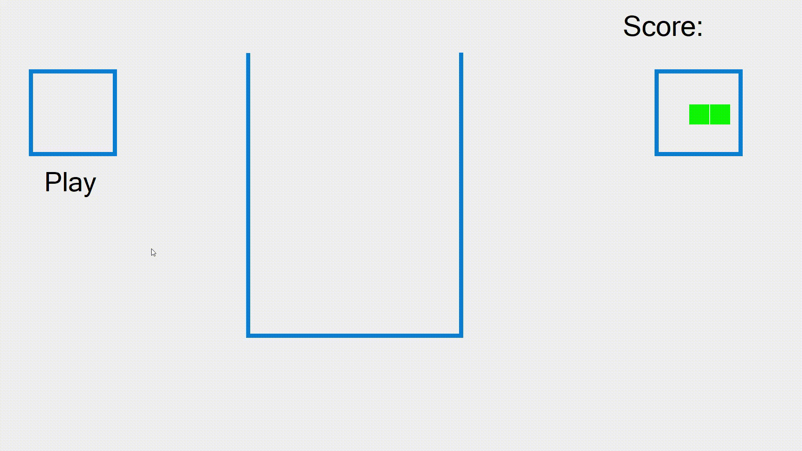

# Retris

## About the game

Have you grown tired of playing tetris will all the predictable game pieces? Then try playing Tetris with random pieces, or Retris.

Every game piece consists of between 1-9 squares in a maximum of 3x3 formation. The pieces should then be dropped on the board so that a horisontal line gets filled with squares. If a line is filled with squares, then those squares will be removed and you will gain 1 point. Try if you can get more points than in the clip below.

## About the project

The purpose with this project was to get more familiar using the C# and the .NET framework. C# is an object oriented programming language and is fairly similar to Java or C++. Using Windows Forms you get access to useful graphics components such as a canvas and PictureBoxes (used for the squares). Using in-built classes have some drawbacks though, for example there is no method for resetting the timer.

The random pieces were generated by using a 3x3 array with default values. A random element E in the array was then set to being a square. Each of E's neighbor are randomized to either square or non-square. Then repeat the same process for each of the newly set squares by checking the neighbors. A non-square can never be set to a square.

The color of the piece depended on which elements that had been set to being squares. If SQ[a,b] is 1 if element on column a and row b is a square and 0 if the same element is not a square; the RGB color of the piece is:
R = SQ[0,0]*42+SQ[1,0]*84+SQ[2,0]*126
G = SQ[0,1]*42+SQ[1,1]*84+SQ[2,1]*126
B = SQ[0,2]*42+SQ[1,2]*84+SQ[2,2]*126
Which is guaranteed to generate a unique color for each piece.

**Note** that the classes have class documentations but are missing method documentations. Send me an email if you need clarification about anything.

## How to install the game

**Note** that the game can only run on windows.

1. Go to the latest [release](https://github.com/Robert-Mellberg/Retris/releases/tag/v1.0)
2. Download the file Tetris.exe
3. Start the game by launching Tetris.exe

## How to install the Visual Studio project

1. Clone the GitHub project
2. Open Tetris.sln with Visual Studio

## Contact information
Robert Mellberg

robmel@kth.se
